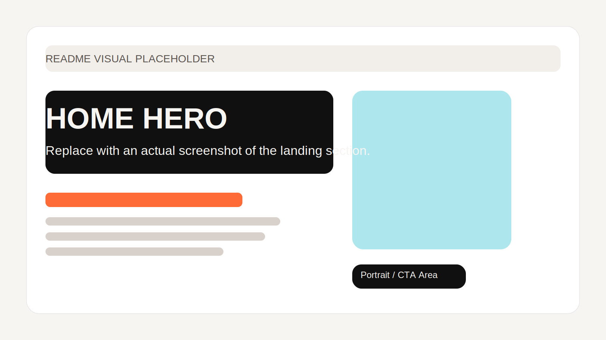
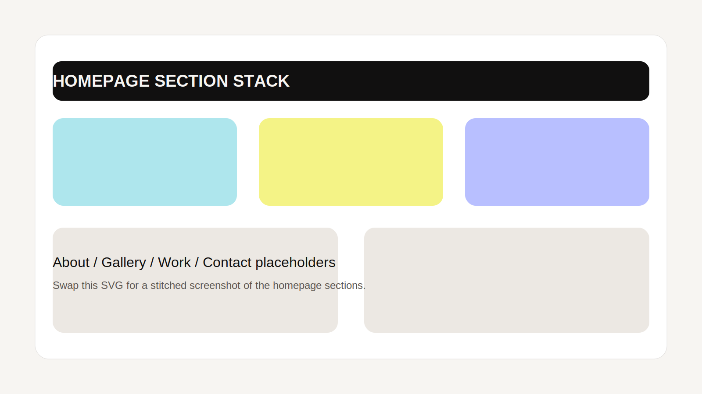
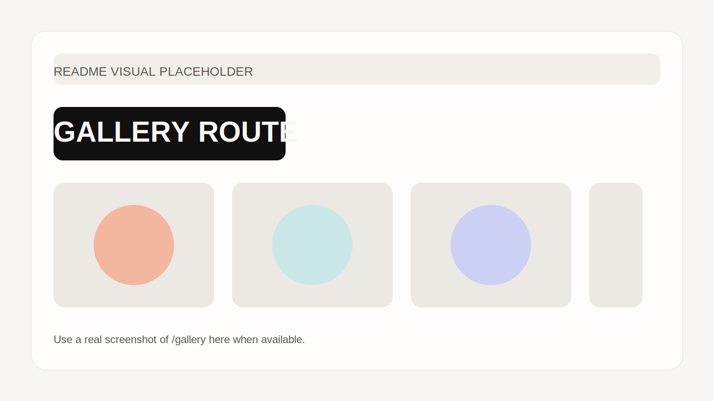
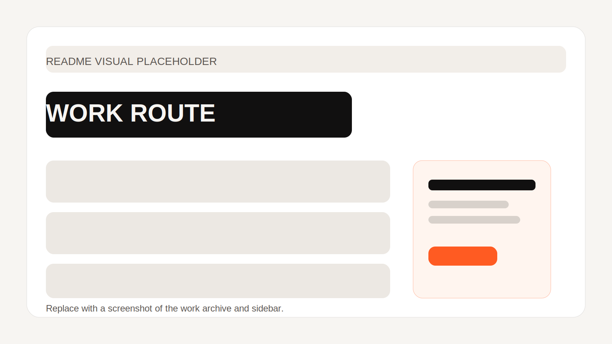
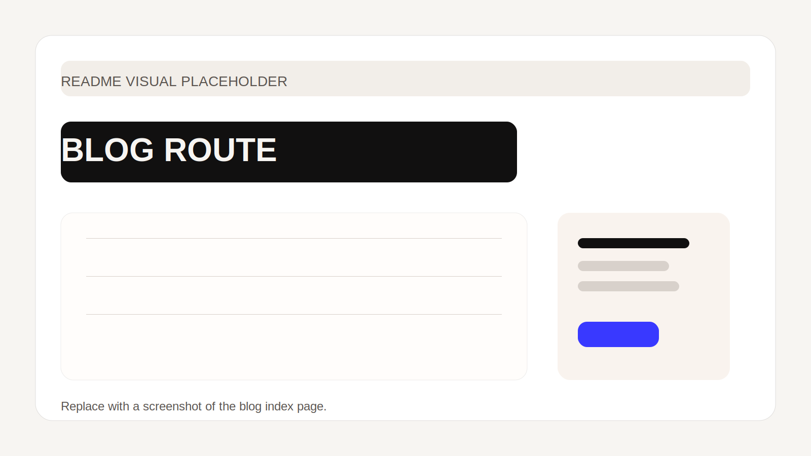
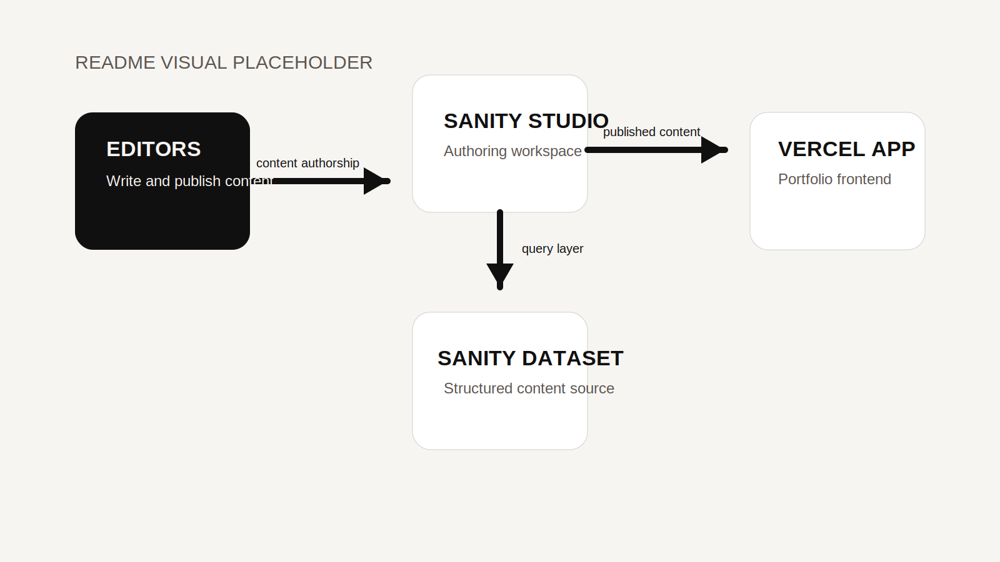

# GRID DESIGN Portfolio

This document explains the portfolio in two ways:

1. What is implemented in the repository today.
2. What the recommended end-state should look like when the site is deployed on Vercel and the blog is powered by Sanity.io.

If you are onboarding, extending the app, or planning the CMS migration, this README is meant to be the single source of truth.

## 1. Current Project Summary

This repository is a Vite-powered React single-page application for Daisy G. / GRID DESIGN.

Today, the app:

- uses React Router for client-side navigation
- renders a single homepage at `/` with anchor-based sections
- renders routed archive-style pages at `/gallery`, `/work`, and `/blog`
- keeps a global WebGL fluid background mounted at the app root
- uses local TypeScript data files for gallery, work, and blog content
- builds to a static `dist/` directory

Today, the app does **not** yet include:

- a live CMS connection
- a Sanity Studio workspace
- article detail routes such as `/blog/:slug`
- automated tests
- Vercel-specific config files in the repo

## 2. Current Tech Stack

### Runtime and framework

- React 19
- TypeScript 5
- Vite 8
- React Router DOM 6
- Framer Motion

### Styling

- Tailwind CSS 3
- PostCSS
- a large global stylesheet in `src/index.css`

Tailwind is present and used for tokens and some component layers, but the visual system is still primarily driven by handcrafted CSS.

### Tooling

- ESLint 9 flat config
- TypeScript project references
- npm scripts for dev, lint, build, and preview

### Build output

- static client bundle emitted to `dist/`

### Hosting target

- Vercel is the recommended host for the frontend

### Recommended CMS

- Sanity.io for structured blog content and editorial workflows

## 3. How The App Is Wired Today

### 3.1 Boot flow

The app boot sequence is:

1. `src/main.tsx`
2. `BrowserRouter`
3. `src/App.tsx`
4. global visual layers
5. route rendering

In practice:

- `src/main.tsx` creates the React root, wraps the app with `BrowserRouter`, and imports `src/index.css`.
- `src/App.tsx` mounts the global UI layers once:
  - `CustomCursor`
  - `FluidCanvas`
  - `GrainFilter`
- `src/App.tsx` defines the application routes:
  - `/`
  - `/gallery`
  - `/work`
  - `/blog`

### 3.2 Route behavior

The current route map is:

- `/` -> homepage composed from stacked sections
- `/gallery` -> full gallery archive page
- `/work` -> full work archive page
- `/blog` -> blog index page

The homepage uses anchor links such as `#about`, `#gallery`, `#work`, and `#contact`.

To preserve context when moving from the homepage into a routed page:

- `RouteEntryLink` stores a `returnTo` hash in route state
- routed pages read that hash with `getReturnToHash`
- the shared `RoutePageHeader` uses that value for the back link

This is why a visitor can enter `/blog` from the homepage and still return to `/#blog`.

### 3.3 Feature composition

The codebase is organized by domain:

```text
src/
  App.tsx
  main.tsx
  index.css
  assets/
  features/
    home/
      pages/
      sections/
      hooks/
    gallery/
      pages/
      components/
      data/
    work/
      pages/
      components/
      data/
    blog/
      pages/
      components/
      data/
  shared/
    components/
    hooks/
    lib/
    types/
```

### 3.4 What each directory owns

#### `src/features/home`

Owns the homepage and section-based experience.

- `pages/HomePage.tsx` composes the homepage
- `sections/` contains `HeroSection`, `AboutSection`, `GallerySection`, `WorkSection`, `BlogSection`, `ContactSection`, `ResumeStrip`, `NavBar`, and `SiteFooter`
- `hooks/useRevealOnScroll.ts` controls reveal animations for homepage elements

#### `src/features/gallery`

Owns the gallery page and gallery data.

- `pages/GalleryPage.tsx` renders the routed gallery experience
- `components/GalleryRoom.tsx` renders each archive room
- `data/gallery.ts` stores gallery records and image references

#### `src/features/work`

Owns the work archive page and work data.

- `pages/WorkPage.tsx`
- `components/WorkProjectRow.tsx`
- `components/WorkSidebar.tsx`
- `data/works.ts`

#### `src/features/blog`

Owns the blog index page and blog data.

- `pages/BlogPage.tsx`
- `components/BlogArticleRow.tsx`
- `components/BlogSidebar.tsx`
- `data/posts.ts`

#### `src/shared`

Owns reusable building blocks used across more than one feature.

- `components/FluidCanvas.tsx`
- `components/CustomCursor.tsx`
- `components/PageTransition.tsx`
- `components/RouteEntryLink.tsx`
- `components/RoutePageHeader.tsx`
- `components/SpotlightFrame.tsx`
- `hooks/useScrollToTop.ts`
- `lib/navigation.ts`
- `types/artwork.ts`

## 4. Current Content And Data Flow

The app is currently content-driven by static TypeScript modules.

### Source of truth today

- gallery content -> `src/features/gallery/data/gallery.ts`
- work content -> `src/features/work/data/works.ts`
- blog content -> `src/features/blog/data/posts.ts`

### Render path today

1. static data file exports arrays and types
2. page or section imports that data
3. presentational components map over those arrays
4. `src/index.css` styles the final UI

### Important implication

Because content is local to the repo right now:

- publishing a new blog item requires a code change
- image updates require a code change
- non-technical editing is not possible yet

That is the main reason Sanity is the right next step.

## 5. Styling System

The styling model is hybrid:

- brand tokens live in CSS variables and Tailwind config
- most layout and interaction styling lives in `src/index.css`
- component class names are part of the visual contract and should be changed carefully

### Styling ownership

- `src/index.css` contains the majority of the visual system
- `tailwind.config.ts` contains theme extensions and font/color tokens
- `postcss.config.cjs` wires Tailwind and Autoprefixer into the Vite build

### Why this matters

When modifying UI:

- prefer preserving existing class names unless you intend to restyle the feature
- avoid moving the fluid canvas into feature-level components
- treat `src/index.css` as the shared presentation layer for the current app

## 6. Visual Placeholders

The following placeholders are local SVGs so the README can display page references even before real screenshots are added.

Replace them later with actual product screenshots if desired.

### Home Hero



### Homepage Sections



### Gallery Route



### Work Route



### Blog Route



### Deployment / CMS Wiring



## 7. Local Development

### Install

```bash
npm install
```

### Run the app

```bash
npm run dev
```

### Lint

```bash
npm run lint
```

### Production build

```bash
npm run build
```

### Preview the built app

```bash
npm run preview
```

## 8. What The Current Production Build Produces

The current build command is:

```bash
npm run build
```

That runs:

```bash
tsc -b && vite build
```

The result is:

- a static `dist/` directory
- hashed JavaScript and CSS assets
- optimized image assets copied into the build output

This means the site is currently deployable as a static SPA.

## 9. Recommended Vercel Deployment Wiring

The current stack is a Vite SPA, so the correct Vercel setup is:

- framework preset: `Vite`
- install command: `npm install`
- build command: `npm run build`
- output directory: `dist`

### 9.1 Important SPA routing requirement

Because React Router handles routes in the browser, deep links like `/blog` or `/gallery` need a rewrite on Vercel.

Recommended `vercel.json`:

```json
{
  "$schema": "https://openapi.vercel.sh/vercel.json",
  "rewrites": [
    {
      "source": "/(.*)",
      "destination": "/index.html"
    }
  ]
}
```

Without this rewrite, direct navigation to routed URLs may 404 on a static deployment.

### 9.2 Frontend deployment steps

1. Push the repository to GitHub, GitLab, or Bitbucket.
2. Import the project into Vercel.
3. Let Vercel detect the project as a Vite app.
4. Set the build command to `npm run build`.
5. Set the output directory to `dist`.
6. Add the SPA rewrite config shown above.
7. Add environment variables for Sanity once the CMS integration is ready.
8. Promote the preview deployment to production when verified.

### 9.3 What Vercel should own

Vercel should own:

- frontend build and hosting
- preview deployments per branch or pull request
- production deployment for the portfolio
- optional serverless functions for secure draft preview or protected content fetching

## 10. Recommended Sanity Blog Integration

Sanity should be used as the content source for the blog, and optionally later for gallery/work content.

### 10.1 Recommended end-state architecture

```text
Editors
  -> Sanity Studio
  -> Sanity Content Lake
  -> Vercel-deployed React frontend
  -> /blog and future /blog/:slug routes
```

### 10.2 Recommended responsibility split

#### Sanity should own

- blog posts
- authors
- categories
- tags
- cover images
- body content
- SEO metadata
- publishing workflow

#### The frontend should own

- layout
- rendering logic
- route behavior
- animation
- image presentation
- content mapping from Sanity documents to UI models

#### Vercel should own

- deployment
- environment variables
- preview environments
- secure server-side preview endpoints if draft mode is needed

## 11. Sanity Integration Plan, Step By Step

This is the safest path to add Sanity without breaking the current app.

### Step 1. Create the Sanity project and Studio

Recommended approach:

- create a Sanity project
- create a separate Studio workspace
- either host the Studio on Sanity's hosted Studio domain or deploy it separately on Vercel

Example bootstrap command for a Studio workspace:

```bash
npm create sanity@latest -- --dataset production --template clean --typescript --output-path studio
```

Recommended repo end-state:

```text
portfolio-frontend/
  src/
  public/
  studio/
```

If you want the lowest-friction setup, host the Studio with Sanity first and keep the frontend on Vercel.

### Step 2. Define the Sanity content model

At minimum, create these document types:

- `post`
- `author`
- `category`
- `siteSettings`

Recommended `post` fields:

- `title`
- `slug`
- `excerpt`
- `publishedAt`
- `coverImage`
- `author`
- `category`
- `tags`
- `body`
- `seoTitle`
- `seoDescription`

Optional but useful:

- `featured`
- `readingTime`
- `ogImage`

### Step 3. Install the frontend packages

When you are ready to wire the CMS into this app, install:

```bash
npm install @sanity/client @portabletext/react @sanity/image-url groq
```

These packages cover:

- querying Sanity
- rendering Portable Text
- building image URLs
- writing GROQ queries

### Step 4. Add environment variables

For the frontend app:

```bash
VITE_SANITY_PROJECT_ID=your_project_id
VITE_SANITY_DATASET=production
VITE_SANITY_API_VERSION=2025-01-01
VITE_SANITY_USE_CDN=true
VITE_SANITY_STUDIO_URL=https://your-project.sanity.studio
```

Important:

- only variables prefixed with `VITE_` are exposed to the browser bundle
- do not expose a private Sanity token in `VITE_` variables
- if you need draft previews, use a Vercel Function or other server-side layer for token-based requests

### Step 5. Add a Sanity integration layer in the frontend

Recommended file layout:

```text
src/
  features/
    blog/
      api/
        sanityClient.ts
        queries.ts
        getBlogPosts.ts
        getBlogPostBySlug.ts
      lib/
        mapSanityPost.ts
      types/
        sanity.ts
```

Recommended responsibility split:

- `sanityClient.ts` -> create and export the configured client
- `queries.ts` -> store GROQ queries in one place
- `getBlogPosts.ts` -> fetch the blog index payload
- `getBlogPostBySlug.ts` -> fetch one article
- `mapSanityPost.ts` -> map CMS documents into UI-friendly types

### Step 6. Keep the current blog UI, swap only the data source

This is the key low-risk migration rule.

Do not rewrite the blog UI first.

Instead:

1. keep `BlogPage.tsx`, `BlogArticleRow.tsx`, and `BlogSidebar.tsx`
2. fetch Sanity data
3. map it into the shape the UI already expects
4. replace static `blogPosts` usage only after the fetched data matches the UI contract

This lets you migrate content without redesigning the experience at the same time.

### Step 7. Add single-post routes

The current app has only a blog index page. For a real CMS-backed blog, the recommended next route is:

```text
/blog/:slug
```

Recommended additions:

- `src/features/blog/pages/BlogPostPage.tsx`
- route definition in `src/App.tsx`
- a Sanity query by slug
- Portable Text rendering for the post body

### Step 8. Add image handling

Sanity images should be rendered through the image URL builder rather than stored in the frontend repo.

That lets you:

- request responsive sizes
- crop cleanly
- reduce payload size
- keep content images in the CMS instead of source control

### Step 9. Add draft preview only if needed

If editorial preview is required:

- do not fetch drafts directly from browser code with a secret token
- add a Vercel Function in `api/`
- store the private token in Vercel environment variables
- let the function fetch draft content securely

This is the safe pattern for preview content in a Vite frontend.

## 12. Recommended End-State Wiring

When everything is wired correctly, the flow should be:

1. an editor writes a post in Sanity Studio
2. Sanity stores the content in the Content Lake
3. the frontend reads published content through `@sanity/client`
4. Vercel serves the portfolio app
5. the `/blog` page lists published posts
6. the `/blog/:slug` page renders the full article
7. preview environments on Vercel validate content and UI changes before production release

## 13. Recommended Final Deployment Topology

### Frontend

- hosted on Vercel
- built from this repository
- served as a Vite SPA
- uses a rewrite for deep links

### CMS

- Sanity Content Lake holds structured content
- Sanity Studio is either:
  - hosted by Sanity at `your-project.sanity.studio`, or
  - deployed as a separate app on Vercel

### Data access

- public published content can be fetched client-side
- draft or token-protected content should be fetched server-side

## 14. Environment Variable Matrix

### Frontend app

```bash
VITE_SANITY_PROJECT_ID=
VITE_SANITY_DATASET=
VITE_SANITY_API_VERSION=
VITE_SANITY_USE_CDN=
VITE_SANITY_STUDIO_URL=
```

### Server-side preview only

```bash
SANITY_API_READ_TOKEN=
```

Never expose `SANITY_API_READ_TOKEN` to browser code.

## 15. What Should Stay Stable During The CMS Migration

These parts should remain stable while Sanity is introduced:

- route URLs
- homepage section anchors
- existing CSS class names where possible
- `FluidCanvas` mounted at app root
- reusable shared components
- current visual layout of blog cards and archive pages

This keeps the migration low-risk.

## 16. Known Gaps In The Current Repository

These are still true after the documentation update:

- the blog is still powered by static data
- there is no Sanity client in the frontend yet
- there is no Sanity Studio in this repository yet
- there is no `vercel.json` in the repo yet
- there are no article detail routes yet
- there is no automated test suite yet
- `ResumeStrip` still references a missing resume asset

## 17. Recommended Next Implementation Order

If the next milestone is execution, the safest order is:

1. add `vercel.json` rewrite support
2. create the Sanity project and content model
3. create a Studio workspace
4. install the Sanity client packages in the frontend
5. add a frontend API layer for blog queries
6. swap the blog index from static data to Sanity data
7. add `/blog/:slug`
8. add secure draft preview if needed
9. add tests around route rendering and content loading

## 18. Reference Docs

These official docs informed the recommended deployment and CMS wiring:

- Vercel frontend framework docs: https://vercel.com/docs/frameworks/frontend
- Vercel deployments overview: https://vercel.com/docs/platform/deployments
- Sanity getting started: https://www.sanity.io/docs/getting-started
- Sanity schema docs: https://www.sanity.io/docs/schema-field-types
- Sanity JavaScript client: https://www.sanity.io/docs/apis-and-sdks/js-client-getting-started
- Sanity querying guide: https://www.sanity.io/docs/apis-and-sdks/js-client-querying
- Sanity Portable Text guide: https://www.sanity.io/docs/developer-guides/presenting-block-text
- Sanity Studio hosting: https://www.sanity.io/docs/setup-and-deployment
